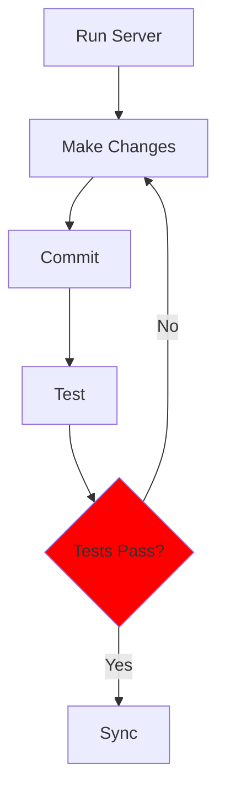
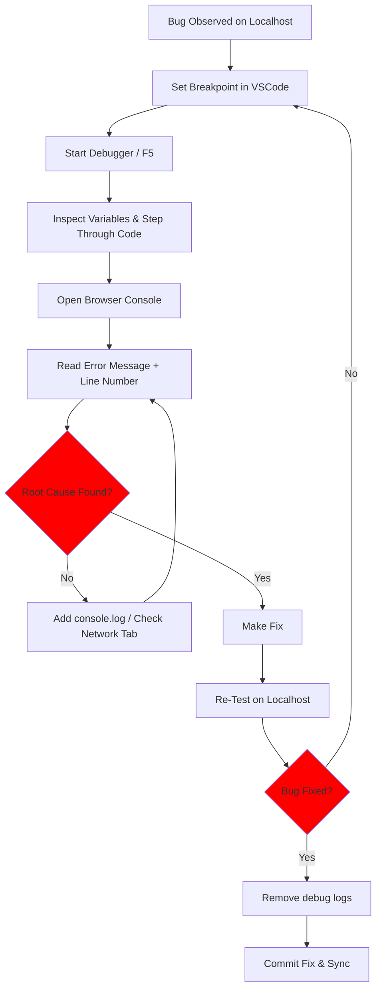

## Starting a Project

The following commands are universal for all machine types, terminals, and projects. The previous installation steps ensured that all machine types have compatible tools. Follow these steps in order:

### Open a Linux-supported Terminal

You are using Ubuntu, Kali, MacOS in this step.

### Clone repository

Use same repo that you modified in vscode.dev.

Change the commands below to use your own organization name (**not** "opencs" of "jm1021").  This is your personal template repository (**not** "open-coding-society/student.git").

For example, if your GitHub organization is **jm1021** and your repo is ****student**, use:

   ```bash
   cd                # move to your home directory
   mkdir -p jm1021   # use your organization name here
   cd jm1021         # use your organization name here
   git clone https://github.com/jm1021/student.git   # use your organization/repo here
   ```

### Prepare project prior to opening VS Code

   ```bash
   cd student # Move to your personal project directory
   ./scripts/venv.sh # Activate the virtual environment (observe the prompt change)
   source venv/bin/activate # Prefix (venv) in path
   bundle install # Ensure Ruby gems for GitHub Pages is installed in (venv)
   code . # Open the project in VS Code
   ```

### Authenticate with GitHub

* At some point, you may be prompted to authenticate with GitHub. Follow the dialog and instructions.

### For WSL Users Only

* Ensure that VS Code is opened in WSL. Check the bottom-left corner of the VS Code window to confirm. This is critical for success!
   

---

## Software Development Life Cycle (SDLC)

The development cycle involves iterative steps of running the server, making changes, testing, committing, and syncing changes to GitHub. This process ensures that your website is updated and functioning correctly both locally and on GitHub Pages.

### SDLC Workflow

```text
+-------------------+       +-------------------+       +-------------------+       +-------------------+       +-------------------+
|                   |       |                   |       |                   |       |                   |       |                   |
|   Make Server     | ----> |   Change Code     | ----> |     Commit        | ----> |      Test         | ----> |     Sync          |
|                   |       |                   |       |                   |       |                   |       |                   |
+-------------------+       +-------------------+       +-------------------+       +-------------------+       +-------------------+
        |                           |                           |                           |                           |
        v                           v                           v                           v                           v
 Start Local Server           Edit Code Files           Stage Changes Locally        Verify Local Changes        Push Changes to Cloud
```

### Open Project and Make

All students are building a GitHub Pages website.  These steps get your website running on your desktop (local or cloud).

#### What is `make`?

Think of `make` as a smart **task helper** for developers.

* It **automates commands** you would normally type one by one.
* It starts a **localhost server** on you machine, enabling Testing prior to Sync.
* It reads a special file called a **Makefile**, which lists tasks and how to run them.  

Simply run:

```bash
make
```

And it will do everything listed in the `Makefile`.

1. Open a terminal

2. Navigate to your project directory

3. Activate virtual environment (venv) `source venv/bin/activate`

4. Open VSCode `code .`

5. Open a VSCode Terminal

6. Type `make` This runs a build to a local server. Repeat this command as often as you make changes.

7. Hover then Cmd or Ctl Click on the localhost Server Address **<http://localhost:> ...** provided in the terminal output from the make command.

```bash
### Congratulations!!! An output similar to below means tool and equipment success ###
(venv) johnmortensen@Mac pages % make
Stopping server...
Stopping logging process...
Starting server with current config/Gemfile...
Server PID: 40638
appending output to nohup.out
Server started in 17 seconds
    Server address: http://localhost:4500/
Terminal logging starting, watching server for regeneration...
Server started in 0 seconds
Configuration file: /Users/johnmortensen/opencs/pages/_config.yml
            Source: /Users/johnmortensen/opencs/pages
       Destination: /Users/johnmortensen/opencs/pages/_site
 Incremental build: enabled
      Generating... 
      Remote Theme: Using theme jekyll/minima
                    done in 16.396 seconds.
 Auto-regeneration: enabled for '/Users/johnmortensen/opencs/pages'
    Server address: http://localhost:4500/
```

#### Make workflow (local build: make, make dev, make clean, make stop, make convert)

These commands are used to build and manage a localhost version of the website. The purpose of this is to verify and test code changes prior to pushing changes to GitHub Pages.

* `make`: Runs the full local server with all features and document overhead.

* `make dev`: Runs a **minimal, faster build** intended for developers actively coding. Skips heavy document processing so the server starts and regenerates quickly. Use this when you are iterating on game logic, layouts, or interactive features and want rapid feedback.

* `make clean`: Stops the local server and cleans the build files. Try this after rename as it could cause duplicates in build.

* `make stop`: Stops the local server. This means you will be unable to access your blog on <http://localhost> until you run `make` again.

* `make convert`: Converts Jupyter Notebook files. Run this if your `.ipynb` files are not updating on the server; it may assist in finding the error.

---

#### Make Debug Lab — Interactive Practice

Got errors? This interactive lab covers common `make` errors **and browser DevTools debugging** scenarios. Use the **Learn** tab for a quick reference, then test yourself in **Practice** by solving errors to reveal pixel art.

<details>
<summary><strong>Click to open the Make Debug Lab</strong></summary>

<div style="margin-top: 1rem;">

<style>
  .mdb * { margin: 0; padding: 0; box-sizing: border-box; }
  .mdb { background: #0a0e14; color: #e6e6e6; line-height: 1.6; padding: 1.5rem; border-radius: 8px; font-family: sans-serif; }
  .mdb h2 { font-size: 1.8rem; color: #00ff9f; margin-bottom: 0.25rem; }
  .mdb .subtitle { color: #8f93a2; margin-bottom: 1.5rem; }
  .mdb .os-selector { display: flex; gap: 0.75rem; margin-bottom: 1.5rem; }
  .mdb .os-btn { background: #151921; border: 1px solid #2d3340; padding: 0.5rem 1.25rem; color: #8f93a2; cursor: pointer; font-size: 0.85rem; transition: all 0.3s; border-radius: 4px; }
  .mdb .os-btn.active { background: #1f2430; border-color: #00ff9f; color: #00ff9f; }
  .mdb .tabs { display: flex; gap: 1.5rem; border-bottom: 1px solid #2d3340; margin-bottom: 1.5rem; }
  .mdb .tab { background: none; border: none; padding: 0.75rem 0; color: #8f93a2; cursor: pointer; font-size: 0.95rem; border-bottom: 2px solid transparent; transition: all 0.3s; }
  .mdb .tab.active { color: #00ff9f; border-bottom-color: #00ff9f; }
  .mdb .tab-content { display: none; }
  .mdb .tab-content.active { display: block; }
  .mdb .error-grid { display: grid; gap: 1.25rem; }
  .mdb .error-card { background: #151921; border: 1px solid #2d3340; padding: 1.25rem; border-radius: 6px; transition: all 0.3s; }
  .mdb .error-card:hover { border-color: #00ff9f; }
  .mdb .error-title { font-size: 1rem; color: #00ccff; margin-bottom: 0.75rem; }
  .mdb .error-msg { background: #0a0e14; border-left: 3px solid #ff3366; padding: 0.6rem 0.75rem; margin: 0.75rem 0; color: #ff3366; font-size: 0.8rem; overflow-x: auto; font-family: monospace; border-radius: 2px; }
  .mdb .info-msg { background: #0a0e14; border-left: 3px solid #ffe66d; padding: 0.6rem 0.75rem; margin: 0.75rem 0; color: #ffe66d; font-size: 0.8rem; overflow-x: auto; font-family: monospace; border-radius: 2px; }
  .mdb .step { background: #1f2430; padding: 0.6rem 0.75rem; margin: 0.4rem 0; border-left: 2px solid #00ccff; font-size: 0.85rem; border-radius: 2px; }
  .mdb .cmd { background: #0a0e14; padding: 0.4rem 0.75rem; margin: 0.4rem 0; font-size: 0.8rem; color: #39ff14; font-family: monospace; border-radius: 2px; }
  .mdb .cmd::before { content: '$ '; color: #00ff9f; }
  .mdb .os-sp { display: none; }
  .mdb .os-sp.active { display: block; }
  .mdb .section-header { font-size: 1.1rem; color: #00ff9f; margin: 1.5rem 0 0.75rem 0; padding-bottom: 0.4rem; border-bottom: 1px solid #2d3340; }
  .mdb .badge { display: inline-block; font-size: 0.7rem; padding: 0.15rem 0.5rem; border-radius: 3px; margin-left: 0.5rem; vertical-align: middle; font-weight: bold; }
  .mdb .badge-make { background: #1f2430; color: #00ccff; border: 1px solid #00ccff; }
  .mdb .badge-devtools { background: #1f2430; color: #ffe66d; border: 1px solid #ffe66d; }
  .mdb .game-container { background: #0d1117; border: 2px solid #00ff9f; padding: 1.5rem; border-radius: 6px; }
  .mdb .game-title { font-size: 1.5rem; color: #00ff9f; text-align: center; margin-bottom: 0.25rem; }
  .mdb .game-subtitle { color: #8f93a2; font-size: 0.85rem; text-align: center; margin-bottom: 1.5rem; }
  .mdb .stats { display: flex; justify-content: space-around; padding: 0.75rem; background: rgba(0,255,159,0.05); border: 1px solid #2d3340; margin-bottom: 1.5rem; border-radius: 4px; }
  .mdb .stat-label { font-size: 0.75rem; color: #8f93a2; text-transform: uppercase; text-align: center; }
  .mdb .stat-value { font-size: 1.5rem; color: #00ff9f; font-weight: bold; text-align: center; }
  .mdb .canvas-area { background: #000; border: 2px solid #2d3340; padding: 1.25rem; border-radius: 8px; margin-bottom: 1.5rem; }
  .mdb .canvas-title { color: #00ccff; margin-bottom: 1rem; text-align: center; font-size: 1rem; }
  .mdb .pixel-grid { display: grid; grid-template-columns: repeat(7, 1fr); gap: 5px; max-width: 420px; margin: 0 auto; background: #1a1f2e; padding: 14px; border-radius: 8px; }
  .mdb .pixel { aspect-ratio: 1; background: #0a0e14; border: 2px solid #2d3340; cursor: pointer; transition: all 0.3s; display: flex; align-items: center; justify-content: center; font-size: 0.9rem; color: #8f93a2; font-weight: bold; border-radius: 4px; }
  .mdb .pixel:hover { border-color: #00ff9f; transform: scale(1.08); }
  .mdb .pixel.filled { cursor: default; border-color: transparent; }
  .mdb .pixel.filled:hover { transform: scale(1); }
  .mdb .clue-section { background: #151921; border: 2px solid #2d3340; padding: 1.25rem; border-radius: 8px; }
  .mdb .clue-title { color: #00ccff; font-size: 1rem; margin-bottom: 0.75rem; }
  .mdb .color-legend { background: #1f2430; padding: 0.75rem 1rem; border-radius: 4px; display: flex; gap: 0.75rem; flex-wrap: wrap; margin-bottom: 1rem; }
  .mdb .legend-item { display: flex; align-items: center; gap: 0.4rem; font-size: 0.75rem; }
  .mdb .legend-color { width: 16px; height: 16px; border: 1px solid #2d3340; border-radius: 3px; flex-shrink: 0; }
  .mdb .current-clue { background: #1f2430; border: 2px solid #00ff9f; padding: 1.25rem; border-radius: 8px; }
  .mdb .clue-error { background: #0a0e14; border-left: 4px solid #ff3366; padding: 0.75rem; margin-bottom: 1rem; color: #ff3366; font-size: 0.85rem; font-family: monospace; border-radius: 2px; }
  .mdb .clue-devtools { background: #0a0e14; border-left: 4px solid #ffe66d; padding: 0.75rem; margin-bottom: 1rem; color: #ffe66d; font-size: 0.85rem; font-family: monospace; border-radius: 2px; }
  .mdb .clue-question { color: #e6e6e6; margin-bottom: 1rem; font-size: 0.95rem; }
  .mdb .answer-options { display: grid; gap: 0.75rem; }
  .mdb .answer-btn { background: #0a0e14; border: 2px solid #2d3340; padding: 1rem; color: #e6e6e6; cursor: pointer; text-align: left; transition: all 0.3s; font-size: 0.9rem; border-radius: 4px; width: 100%; }
  .mdb .answer-btn:hover { border-color: #00ff9f; background: #151921; transform: translateX(4px); }
  .mdb .answer-btn.correct { border-color: #00ff9f; background: rgba(0,255,159,0.1); }
  .mdb .answer-btn.incorrect { border-color: #ff3366; background: rgba(255,51,102,0.1); }
  .mdb .completion { text-align: center; padding: 2rem; background: linear-gradient(135deg, rgba(0,255,159,0.1), rgba(0,204,255,0.1)); border: 2px solid #00ff9f; display: none; border-radius: 8px; margin-top: 1rem; }
  .mdb .completion.show { display: block; }
  .mdb .completion-title { font-size: 2rem; color: #00ff9f; margin-bottom: 0.5rem; }
  .mdb .completion-message { color: #8f93a2; margin-bottom: 1.5rem; }
  .mdb .final-art { max-width: 420px; margin: 1rem auto; padding: 1.25rem; background: #000; border: 3px solid #00ff9f; border-radius: 8px; }
  .mdb .restart-btn { background: #151921; border: 2px solid #00ff9f; padding: 0.75rem 1.75rem; color: #00ff9f; cursor: pointer; font-size: 0.95rem; margin-top: 1rem; transition: all 0.3s; border-radius: 4px; }
  .mdb .restart-btn:hover { background: #1f2430; }
</style>

<div class="mdb">
  <h2>Make &amp; DevTools Debug Lab</h2>
  <p class="subtitle">Learn to resolve common make errors and use browser DevTools to debug game issues</p>

  <div class="os-selector">
    <button class="os-btn active" data-os="mac" onclick="mdbSwitchOS('mac')">macOS</button>
    <button class="os-btn" data-os="windows" onclick="mdbSwitchOS('windows')">Windows</button>
  </div>

  <div class="tabs">
    <button class="tab active" onclick="mdbSwitchTab('learn', event)">Learn</button>
    <button class="tab" onclick="mdbSwitchTab('practice', event)">Practice</button>
  </div>

  <div id="mdb-learn" class="tab-content active">
    <div class="error-grid">

      <h3 class="section-header">Make Errors <span class="badge badge-make">Terminal</span></h3>

      <div class="error-card">
        <h3 class="error-title">Make Not Found</h3>
        <div class="error-msg os-sp active" id="mdb-mac-err1">make: command not found</div>
        <div class="error-msg os-sp" id="mdb-win-err1">'make' is not recognized as an internal or external command</div>
        <p style="font-size:0.9rem; color:#8f93a2; margin: 0.5rem 0;">Your system does not have make installed.</p>
        <div class="os-sp active" id="mdb-mac-sol1">
          <div class="step">Install Xcode Command Line Tools</div>
          <div class="cmd">xcode-select --install</div>
          <div class="step">Verify installation</div>
          <div class="cmd">make --version</div>
        </div>
        <div class="os-sp" id="mdb-win-sol1">
          <div class="step">Install WSL</div>
          <div class="cmd">wsl --install</div>
          <div class="step">Install make in WSL</div>
          <div class="cmd">sudo apt update && sudo apt install make</div>
        </div>
      </div>

      <div class="error-card">
        <h3 class="error-title">No Makefile Found</h3>
        <div class="error-msg">make: *** No targets specified and no makefile found. Stop.</div>
        <p style="font-size:0.9rem; color:#8f93a2; margin: 0.5rem 0;">Make cannot find the Makefile. You are probably in the wrong directory.</p>
        <div class="step">Check current directory</div>
        <div class="cmd">pwd</div>
        <div class="step">List files to confirm Makefile exists</div>
        <div class="cmd os-sp active" id="mdb-mac-ls">ls -la</div>
        <div class="cmd os-sp" id="mdb-win-ls">dir</div>
        <div class="step">Navigate to project directory</div>
        <div class="cmd">cd /path/to/project</div>
      </div>

      <div class="error-card">
        <h3 class="error-title">No Rule to Make Target</h3>
        <div class="error-msg">make: *** No rule to make target 'sever'. Stop.</div>
        <p style="font-size:0.9rem; color:#8f93a2; margin: 0.5rem 0;">The target you specified does not exist. Check for typos.</p>
        <div class="step">List available targets</div>
        <div class="cmd os-sp active" id="mdb-mac-grep">grep "^[a-zA-Z]" Makefile</div>
        <div class="cmd os-sp" id="mdb-win-grep">findstr /B /R "^[a-zA-Z]" Makefile</div>
        <div class="step">Fix the typo in your command — or use make dev for a faster build</div>
        <div class="cmd">make server</div>
        <div class="cmd">make dev</div>
      </div>

      <div class="error-card">
        <h3 class="error-title">Missing Separator</h3>
        <div class="error-msg">Makefile:5: *** missing separator. Stop.</div>
        <p style="font-size:0.9rem; color:#8f93a2; margin: 0.5rem 0;">Commands in Makefiles must be indented with TAB characters, not spaces.</p>
        <div class="step">Open Makefile and go to the indicated line</div>
        <div class="step">Delete any spaces at the beginning of command lines</div>
        <div class="step">Press TAB key once before each command</div>
      </div>

      <div class="error-card">
        <h3 class="error-title">Permission Denied</h3>
        <div class="error-msg">make: ./script.sh: Permission denied</div>
        <p style="font-size:0.9rem; color:#8f93a2; margin: 0.5rem 0;">The script does not have execute permissions.</p>
        <div class="step">Add execute permission</div>
        <div class="cmd">chmod +x script.sh</div>
        <div class="step">Run make again</div>
      </div>

      <div class="error-card">
        <h3 class="error-title">Command Not Found in Makefile</h3>
        <div class="error-msg">make: *** [server] Error 127<br>/bin/sh: python3: command not found</div>
        <p style="font-size:0.9rem; color:#8f93a2; margin: 0.5rem 0;">The Makefile is trying to run a command that is not installed.</p>
        <div class="step">Check if command exists</div>
        <div class="cmd os-sp active" id="mdb-mac-which">which python3</div>
        <div class="cmd os-sp" id="mdb-win-which">where python3</div>
        <div class="step">Install the missing tool</div>
        <div class="cmd os-sp active" id="mdb-mac-install">brew install python3</div>
        <div class="cmd os-sp" id="mdb-win-install">winget install Python.Python.3</div>
      </div>

      <h3 class="section-header">Game / Browser DevTools Errors <span class="badge badge-devtools">DevTools</span></h3>
      <p style="font-size:0.875rem; color:#8f93a2; margin-bottom:1rem;">When building or debugging a game in your GitHub Pages project, use browser DevTools (F12 or Cmd+Option+I) to diagnose these common issues. Run <code style="color:#39ff14;font-size:0.8rem;">make dev</code> for a fast local server while iterating on game code.</p>

      <div class="error-card">
        <h3 class="error-title">Collision Bug — Elements View</h3>
        <div class="info-msg">Player passes through wall / hitbox looks wrong in the game</div>
        <p style="font-size:0.9rem; color:#8f93a2; margin: 0.5rem 0;">The collision box does not match the visible sprite. Inspect the element to see its real size and position.</p>
        <div class="step">Open DevTools → Elements tab (Cmd+Option+I → Elements)</div>
        <div class="step">Hover over the player or wall element in the DOM — the browser highlights its bounding box on screen</div>
        <div class="step">Check that width, height, and position CSS match your expected hitbox dimensions</div>
        <div class="step">Fix the discrepancy in your CSS or JavaScript collision logic</div>
        <div class="cmd">// Example: log element bounds in console
const box = player.getBoundingClientRect();
console.log(box.width, box.height, box.x, box.y);</div>
      </div>

      <div class="error-card">
        <h3 class="error-title">Style Bug — CSS View</h3>
        <div class="info-msg">Sprite is invisible, wrong color, or in the wrong position</div>
        <p style="font-size:0.9rem; color:#8f93a2; margin: 0.5rem 0;">A style rule is overriding your intended CSS. Use the Styles panel to find the conflict.</p>
        <div class="step">Open DevTools → Elements → Styles panel</div>
        <div class="step">Select the game element — look for strikethrough rules, which means a rule is being overridden</div>
        <div class="step">Identify the conflicting selector with higher specificity and either increase your specificity or remove the conflict</div>
        <div class="step">Toggle rules on/off live in the Styles panel to test fixes before changing code</div>
        <div class="cmd">/* Example: use a more specific selector to override */
#game-canvas .player-sprite { display: block; visibility: visible; }</div>
      </div>

      <div class="error-card">
        <h3 class="error-title">CORS Error — Network View</h3>
        <div class="error-msg">Access to fetch at 'https://api.example.com/npc-data' from origin 'http://localhost:4500' has been blocked by CORS policy</div>
        <p style="font-size:0.9rem; color:#8f93a2; margin: 0.5rem 0;">Your game is fetching data (NPC configs, maps, scores) from a server that has not allowed your origin. Check the Network tab to diagnose.</p>
        <div class="step">Open DevTools → Network tab, then reload or trigger the fetch</div>
        <div class="step">Find the failing request (shown in red) and click it to see Response Headers</div>
        <div class="step">Look for <code>Access-Control-Allow-Origin</code> — if missing or wrong, the server must add it</div>
        <div class="step">As a local workaround during <code>make dev</code>, proxy the request through your Jekyll server or use a CORS-friendly test API</div>
        <div class="cmd">// Example: catch CORS errors explicitly
fetch('https://api.example.com/npc-data')
  .catch(err => console.error('CORS or network error:', err));</div>
      </div>

      <div class="error-card">
        <h3 class="error-title">Logic Bug — Player / NPC Interaction</h3>
        <div class="info-msg">NPC does not react to player / interaction triggers at wrong time</div>
        <p style="font-size:0.9rem; color:#8f93a2; margin: 0.5rem 0;">The interaction condition in your game logic has a bug. Use the Console and Sources tabs to step through the code.</p>
        <div class="step">Open DevTools → Console — look for errors or add <code>console.log</code> calls inside your interaction handler</div>
        <div class="step">Open DevTools → Sources → find your game JS file and set a breakpoint on the interaction function</div>
        <div class="step">Trigger the interaction in the game — execution pauses at the breakpoint so you can inspect variable values</div>
        <div class="step">Check distance/overlap calculations, event listener binding, and state flags (e.g., <code>isNearNPC</code>)</div>
        <div class="cmd">// Example: debug interaction check
function checkInteraction(player, npc) {
  const dist = Math.hypot(player.x - npc.x, player.y - npc.y);
  console.log('distance to NPC:', dist, '| threshold:', npc.triggerRadius);
  if (dist < npc.triggerRadius) npc.interact();
}</div>
      </div>

    </div>
  </div>

  <div id="mdb-practice" class="tab-content">
    <div class="game-container">
      <h2 class="game-title">Debug Art Challenge</h2>
      <p class="game-subtitle">Answer error clues correctly to reveal the hidden pixel art — now with DevTools challenges!</p>
      <div class="stats">
        <div class="stat"><div class="stat-label">Progress</div><div class="stat-value" id="mdb-progress">0/21</div></div>
        <div class="stat"><div class="stat-label">Correct</div><div class="stat-value" id="mdb-correct">0</div></div>
        <div class="stat"><div class="stat-label">Errors</div><div class="stat-value" id="mdb-errors">0</div></div>
      </div>
      <div class="canvas-area">
        <h3 class="canvas-title">Click a number to solve its error</h3>
        <div class="pixel-grid" id="mdb-pixelGrid"></div>
      </div>
      <div class="clue-section">
        <h3 class="clue-title">Current Clue</h3>
        <div class="color-legend">
          <div class="legend-item"><div class="legend-color" style="background:#ff6b6b;"></div><span>1 - Not Found</span></div>
          <div class="legend-item"><div class="legend-color" style="background:#4ecdc4;"></div><span>2 - No File</span></div>
          <div class="legend-item"><div class="legend-color" style="background:#ffe66d;"></div><span>3 - Typo</span></div>
          <div class="legend-item"><div class="legend-color" style="background:#a8e6cf;"></div><span>4 - Tab</span></div>
          <div class="legend-item"><div class="legend-color" style="background:#ff8b94;"></div><span>5 - Permission</span></div>
          <div class="legend-item"><div class="legend-color" style="background:#c7ceea;"></div><span>6 - Tool</span></div>
          <div class="legend-item"><div class="legend-color" style="background:#f7b731;"></div><span>7 - Collision</span></div>
          <div class="legend-item"><div class="legend-color" style="background:#a29bfe;"></div><span>8 - Style</span></div>
          <div class="legend-item"><div class="legend-color" style="background:#fd79a8;"></div><span>9 - CORS</span></div>
          <div class="legend-item"><div class="legend-color" style="background:#55efc4;"></div><span>10 - Logic</span></div>
        </div>
        <div class="current-clue">
          <div class="clue-error" id="mdb-clueError">Click a numbered pixel above to start!</div>
          <div class="clue-question" id="mdb-clueQuestion">Select any pixel with a number to see its error.</div>
          <div class="answer-options" id="mdb-answerOptions"></div>
        </div>
      </div>
      <div class="completion" id="mdb-completion">
        <div class="completion-title">Build Successful!</div>
        <p class="completion-message">You have mastered make and DevTools debugging</p>
        <div class="final-art"><div class="pixel-grid" id="mdb-finalImage" style="max-width:100%;"></div></div>
        <div class="stats">
          <div class="stat"><div class="stat-label">Accuracy</div><div class="stat-value" id="mdb-accuracy">0%</div></div>
        </div>
        <button class="restart-btn" onclick="mdbRestart()">Build Again</button>
      </div>
    </div>
  </div>
</div>

<script>

// =============================================================================
// MDB_DATA — stores all static game data (clues, colors, pixel pattern)
// Only change this when clue text, colors, or the grid pattern needs updating
// =============================================================================
const MDB_DATA = {
  colors: {
    1: '#ff6b6b', 2: '#4ecdc4', 3: '#ffe66d', 4: '#a8e6cf',
    5: '#ff8b94', 6: '#c7ceea', 7: '#f7b731', 8: '#a29bfe',
    9: '#fd79a8', 10: '#55efc4'
  },
  pattern: [
    [1, 1, 0,  7, 0,  9,  9],
    [2, 4, 4,  7, 8,  8,  3],
    [2, 5, 5, 10, 8,  3,  3],
    [0, 0, 6, 10, 0,  0,  0],
    [0, 6, 6,  0, 10, 0,  0]
  ],
  clues: [
    {
      type: 1,
      error: "make: command not found",
      question: "What is the solution?",
      answers: [
        { text: "Install make using xcode-select --install or package manager", correct: true },
        { text: "Delete the project", correct: false },
        { text: "Rename the Makefile", correct: false }
      ]
    },
    {
      type: 2,
      error: "make: *** No targets specified and no makefile found. Stop.",
      question: "What should you do?",
      answers: [
        { text: "Navigate to the correct directory with cd", correct: true },
        { text: "Reinstall make", correct: false },
        { text: "Run sudo make", correct: false }
      ]
    },
    {
      type: 3,
      error: "make: *** No rule to make target 'sever'. Stop.",
      question: "How do you fix this?",
      answers: [
        { text: "Fix the typo — use 'make server' or 'make dev' for a faster build", correct: true },
        { text: "Add a new sever target", correct: false },
        { text: "Delete the Makefile", correct: false }
      ]
    },
    {
      type: 4,
      error: "Makefile:5: *** missing separator. Stop.",
      question: "What is the problem?",
      answers: [
        { text: "Replace spaces with TAB character before commands", correct: true },
        { text: "Add more spaces", correct: false },
        { text: "Add semicolons", correct: false }
      ]
    },
    {
      type: 5,
      error: "make: ./script.sh: Permission denied",
      question: "How do you fix this?",
      answers: [
        { text: "Run chmod +x script.sh to add execute permission", correct: true },
        { text: "Delete and recreate the file", correct: false },
        { text: "Always use sudo", correct: false }
      ]
    },
    {
      type: 6,
      error: "make: *** [test] Error 127 - /bin/sh: python3: command not found",
      question: "What is the solution?",
      answers: [
        { text: "Install python3 using brew or apt", correct: true },
        { text: "Remove python from Makefile", correct: false },
        { text: "Create a symbolic link", correct: false }
      ]
    },
    {
      type: 7,
      error: "[Game] Player passes through walls — collision not working",
      question: "Which DevTools panel helps you debug a collision hitbox mismatch?",
      answers: [
        { text: "Elements tab — hover over the DOM element to see its real bounding box on screen", correct: true },
        { text: "Network tab — check if wall data loaded correctly", correct: false },
        { text: "Application tab — clear localStorage and retry", correct: false }
      ]
    },
    {
      type: 8,
      error: "[Game] Sprite is invisible on screen despite being in the DOM",
      question: "How do you find the CSS rule that is hiding the sprite?",
      answers: [
        { text: "Elements → Styles panel — look for strikethrough rules being overridden by a higher-specificity selector", correct: true },
        { text: "Network tab — the image must have failed to load", correct: false },
        { text: "Console — run location.reload()", correct: false }
      ]
    },
    {
      type: 9,
      error: "Access to fetch at 'https://api.example.com/npc-data' blocked by CORS policy",
      question: "Where in DevTools do you find the missing Access-Control-Allow-Origin header?",
      answers: [
        { text: "Network tab — click the failing request (red) and inspect Response Headers", correct: true },
        { text: "Console tab — the full header list is printed there automatically", correct: false },
        { text: "Elements tab — check the meta tags in head", correct: false }
      ]
    },
    {
      type: 10,
      error: "[Game] NPC does not react when player walks into trigger zone",
      question: "What is the best first step to debug the player/NPC interaction logic?",
      answers: [
        { text: "Sources tab — set a breakpoint in the interaction function and step through variable values when triggered", correct: true },
        { text: "Network tab — the NPC config file probably did not load", correct: false },
        { text: "Application tab — the interaction state is stored in a cookie", correct: false }
      ]
    }
  ]
};

// =============================================================================
// MDBState — tracks all runtime game state
// Only change this when the set of tracked values or reset logic changes
// =============================================================================
const MDBState = {
  os: 'mac',
  correct: 0,
  errors: 0,
  filled: 0,
  currentPixel: null,

  reset() {
    this.correct = 0;
    this.errors = 0;
    this.filled = 0;
    this.currentPixel = null;
  },

  getTotalPixels() {
    return MDB_DATA.pattern.flat().filter(p => p !== 0).length;
  },

  calculateAccuracy() {
    const total = this.correct + this.errors;
    return total === 0 ? 0 : Math.round((this.correct / total) * 100);
  }
};

// =============================================================================
// MDBOSToggle — handles OS button switching
// Only change this when the OS toggle UI or section IDs change
// =============================================================================
const MDBOSToggle = {
  switch(os) {
    MDBState.os = os;
    this.renderButtons(os);
    this.renderSections(os);
  },

  renderButtons(os) {
    document.querySelectorAll('.mdb .os-btn')
      .forEach(b => b.classList.remove('active'));
    document.querySelector(`.mdb [data-os="${os}"]`)
      .classList.add('active');
  },

  renderSections(os) {
    document.querySelectorAll('.mdb .os-sp')
      .forEach(el => el.classList.remove('active'));
    const prefix = os === 'mac' ? 'mdb-mac-' : 'mdb-win-';
    document.querySelectorAll(`[id^="${prefix}"]`)
      .forEach(el => el.classList.add('active'));
  }
};

// =============================================================================
// MDBStatsTracker — updates the score display in the DOM
// Only change this when the stats UI elements or their formatting changes
// =============================================================================
const MDBStatsTracker = {
  update() {
    const total = MDBState.getTotalPixels();
    document.getElementById('mdb-progress').textContent = `${MDBState.filled}/${total}`;
    document.getElementById('mdb-correct').textContent = MDBState.correct;
    document.getElementById('mdb-errors').textContent = MDBState.errors;
  }
};

// =============================================================================
// MDBCompletionHandler — detects game over and renders the final screen
// Only change this when end-game detection or the completion screen changes
// =============================================================================
const MDBCompletionHandler = {
  check() {
    if (MDBState.filled >= MDBState.getTotalPixels()) {
      setTimeout(() => this.show(), 600);
    }
  },

  show() {
    document.getElementById('mdb-accuracy').textContent = `${MDBState.calculateAccuracy()}%`;
    this.renderFinalGrid();
    document.getElementById('mdb-completion').classList.add('show');
  },

  renderFinalGrid() {
    const fg = document.getElementById('mdb-finalImage');
    fg.innerHTML = '';
    MDB_DATA.pattern.forEach(row => {
      row.forEach(cell => {
        const p = document.createElement('div');
        p.className = 'pixel filled';
        p.style.background = cell !== 0 ? MDB_DATA.colors[cell] : '#000';
        fg.appendChild(p);
      });
    });
  }
};

// =============================================================================
// MDBAnswerChecker — validates answers and updates pixel/button feedback
// Only change this when answer validation or correct/incorrect feedback changes
// =============================================================================
const MDBAnswerChecker = {
  check(correct, colorType, e) {
    this.disableButtons(true);
    if (correct && MDBState.currentPixel) {
      this.handleCorrect(colorType, e);
    } else {
      this.handleIncorrect(e);
    }
    MDBStatsTracker.update();
  },

  handleCorrect(colorType, e) {
    MDBState.correct++;
    MDBState.filled++;

    const { row, col } = MDBState.currentPixel;
    const pixel = document.querySelector(`.mdb [data-row="${row}"][data-col="${col}"]`);
    pixel.style.background = MDB_DATA.colors[colorType];
    pixel.classList.add('filled');
    pixel.textContent = '';
    pixel.style.boxShadow = '';
    e.target.classList.add('correct');

    setTimeout(() => {
      MDBState.currentPixel = null;
      document.getElementById('mdb-clueError').textContent = 'Great! Click another number.';
      document.getElementById('mdb-clueQuestion').textContent = 'Keep going to reveal the image!';
      document.getElementById('mdb-answerOptions').innerHTML = '';
      MDBCompletionHandler.check();
    }, 1000);
  },

  handleIncorrect(e) {
    MDBState.errors++;
    e.target.classList.add('incorrect');
    setTimeout(() => {
      this.disableButtons(false);
      document.querySelectorAll('.mdb .answer-btn')
        .forEach(b => b.classList.remove('incorrect'));
    }, 600);
  },

  disableButtons(disabled) {
    document.querySelectorAll('.mdb .answer-btn')
      .forEach(b => b.disabled = disabled);
  }
};

// =============================================================================
// MDBClueManager — looks up clue data and renders it into the DOM
// Only change this when clue lookup logic or the clue display UI changes
// =============================================================================
const MDBClueManager = {
  getByType(type) {
    return MDB_DATA.clues.find(c => c.type === type);
  },

  render(clue, type) {
    const errorEl = document.getElementById('mdb-clueError');
    errorEl.textContent = clue.error;
    errorEl.className = type >= 7 ? 'clue-devtools' : 'clue-error';
    document.getElementById('mdb-clueQuestion').textContent = clue.question;

    const opts = document.getElementById('mdb-answerOptions');
    opts.innerHTML = '';
    clue.answers
      .slice()
      .sort(() => Math.random() - 0.5)
      .forEach(answer => {
        const btn = document.createElement('button');
        btn.className = 'answer-btn';
        btn.textContent = answer.text;
        btn.onclick = (e) => MDBAnswerChecker.check(answer.correct, type, e);
        opts.appendChild(btn);
      });
  },

  load(type) {
    const clue = this.getByType(type);
    if (clue) this.render(clue, type);
  }
};

// =============================================================================
// MDBGridRenderer — builds the pixel grid DOM elements
// Only change this when the grid layout or individual pixel structure changes
// =============================================================================
const MDBGridRenderer = {
  render() {
    const grid = document.getElementById('mdb-pixelGrid');
    grid.innerHTML = '';
    MDB_DATA.pattern.forEach((row, r) => {
      row.forEach((cell, c) => {
        const p = document.createElement('div');
        p.className = 'pixel';
        p.dataset.row = r;
        p.dataset.col = c;
        p.dataset.color = cell;

        if (cell !== 0) {
          p.textContent = cell;
          p.onclick = () => MDBGame.selectPixel(r, c);
        } else {
          p.style.background = '#000';
          p.classList.add('filled');
        }
        grid.appendChild(p);
      });
    });
  }
};

// =============================================================================
// MDBGame — coordinates overall game flow (init, reset, pixel selection)
// Only change this when the sequence of game startup steps changes
// =============================================================================
const MDBGame = {
  init() {
    MDBState.reset();
    MDBGridRenderer.render();
    this.resetCluePanel();
    document.getElementById('mdb-completion').classList.remove('show');
    MDBStatsTracker.update();
  },

  resetCluePanel() {
    document.getElementById('mdb-clueError').textContent = 'Click a numbered pixel above to start!';
    document.getElementById('mdb-clueQuestion').textContent = 'Select any pixel with a number to see its error.';
    document.getElementById('mdb-answerOptions').innerHTML = '';
  },

  selectPixel(row, col) {
    const pixel = document.querySelector(`.mdb [data-row="${row}"][data-col="${col}"]`);
    if (pixel.classList.contains('filled')) return;

    MDBState.currentPixel = { row, col, color: MDB_DATA.pattern[row][col] };
    document.querySelectorAll('.mdb .pixel').forEach(p => p.style.boxShadow = '');
    pixel.style.boxShadow = '0 0 16px #00ff9f';
    MDBClueManager.load(MDB_DATA.pattern[row][col]);
  }
};

// =============================================================================
// Public API — wires module methods to HTML onclick attributes
// =============================================================================
window.mdbSwitchOS  = (os) => MDBOSToggle.switch(os);
window.mdbSwitchTab = (tab, e) => {
  document.querySelectorAll('.mdb .tab').forEach(t => t.classList.remove('active'));
  e.target.classList.add('active');
  document.querySelectorAll('.mdb .tab-content').forEach(c => c.classList.remove('active'));
  document.getElementById('mdb-' + tab).classList.add('active');
  if (tab === 'practice') MDBGame.init();
};
window.mdbRestart = () => {
  document.getElementById('mdb-completion').classList.remove('show');
  MDBGame.init();
};

MDBGame.init();

</script>

</div>
</details>

---


### VSCode Commit and Sync Workflow

All students will be writing and changing code.  These steps allow you to change the website, first locally and then on public location.

```text
+-------------------+       +-------------------+       +-------------------+       +-------------------+
|                   |       |                   |       |                   |       |                   |
|   VS Code Editor  | ----> |   Local Git Repo  | ----> |   Remote GitHub   | ----> |   GitHub Pages    |
|                   |       |                   |       |                   |       |                   |
+-------------------+       +-------------------+       +-------------------+       +-------------------+
        |                           |                           |                           |
        |                           |                           |                           |
        v                           v                           v                           v
    Save Files                Commit Changes               Sync Changes                Public Website
   Local Website
```

#### Detailed SDLC Steps

The SDLC adds the important steps of Make and Test to the workflow. This ensures that you **never** sync code that is broken locally. This helps the developer troubleshoot errors early and as you are working.

1. Save Files in VS Code:

   * Edit your files.
   * Save the changes (Cmd + S on Mac or Ctrl + S on Windows/Linux).
   * Verify changes on the local web server.

2. Commit Changes in VS Code:

   * Click on the "Source Control" icon in the left sidebar.
   * Stage your changes by clicking the plus sign next to the files.
   * Enter a commit message.
   * Click the "Commit" button.

3. Test Changes on Local Server:

   * Open Terminal.
   * Be sure the "(venv)" prefix is in the prompt.
   * Type `make` in the prompt (run `make`).
   * If you are actively developing a game or interactive feature, use `make dev` instead — it skips heavy document processing for a faster build cycle.
   * If successful, you will see log output in the prompt:

   ```text
       Server address: http://localhost:4500/
   ```

   * If delayed open 2nd terminal using + and execute command `cat \tmp\jekyl4500.log`.  This keeps ongoing history of logs if things are right a below, if things are wrong you will see errors.  

   ```text
   (venv) johnmortensen@Mac pages % cat /tmp/jekyll4500.log 
   Configuration file: /Users/johnmortensen/opencs/pages/_config.yml
               Source: /Users/johnmortensen/opencs/pages
         Destination: /Users/johnmortensen/opencs/pages/_site
   Incremental build: enabled
         Generating... 
         Remote Theme: Using theme jekyll/minima
                     done in 16.396 seconds.
   Auto-regeneration: enabled for '/Users/johnmortensen/opencs/pages'
      Server address: http://localhost:4500/
   Server running... press ctrl-c to stop.
         Regenerating: 1 file(s) changed at 2025-11-20 06:20:27
                     _posts/Foundation/B-tools_and_equipment/2025-04-15-tools_setup-vscode.md
         Remote Theme: Using theme jekyll/minima
                     ...done in 16.992685 seconds.
                     
         Regenerating: 1 file(s) changed at 2025-11-20 06:22:30
                     _posts/Foundation/B-tools_and_equipment/2025-04-15-tools_setup-vscode.md
         Remote Theme: Using theme jekyll/minima
                     ...done in 16.763741 seconds.
   ```

   * Open the localhost Server address in deskop or cloud computer browser `http://localhost:4500/`
   * Test your changes before you commit.

4. Errors in terminal
   * Most likely cause is `(venv)` in prompt `(venv) johnmortensen@Mac pages %`.  This will fail 100% of the time
   * If there are errors in coding the will show in terminal (with a delay/timeout) and be in log: `cat /tmp/jekyll4500.log`
   * Most likely error, is what you just changed!!!  Easiest fix is to undo, see if it fixes things.  Then try again.

5. Regeneration messages
   * Most changes will show regeneration message in terminal after you save file.
   * If you see a message in terminal like the one below, you can test your localhost change by refreshing page you are working on.

   ```text
   Regenerating: 1 file(s) changed at 2025-11-20 06:40:18
                     _posts/Foundation/B-tools_and_equipment/2025-04-15-tools_setup-vscode.md
         Remote Theme: Using theme jekyll/minima
                     ...done in 16.537365 seconds.
   ```

6. Sync Changes to GitHub:

   * Never sync changes before you test, as this activates Actions on GitHub.
   * Click the "Sync Changes" button in the Source Control view.
   * This pushes your local commits to the remote GitHub repository.

7. Update GitHub Pages:

   * GitHub Pages Action automatically rebuilds your site with the latest changes.
   * Visit your public website at https://<yourGitHubID>.github.io/student to see the updates.




<html lang="en">
<head>
<meta charset="UTF-8">
<meta name="viewport" content="width=device-width, initial-scale=1.0">
<title>Rock Paper Scissors — Console Debugging Lesson</title>
<link href="https://fonts.googleapis.com/css2?family=Press+Start+2P&family=Share+Tech+Mono&display=swap" rel="stylesheet">
<style>
  :root {
    --bg: #0a0a0f;
    --surface: #111118;
    --surface2: #16161f;
    --border: #2a2a3a;
    --accent: #7c3aed;
    --accent2: #a855f7;
    --cyan: #22d3ee;
    --green: #4ade80;
    --red: #f87171;
    --yellow: #fbbf24;
    --text: #e2e8f0;
    --muted: #94a3b8;
    --font-pixel: 'Press Start 2P', cursive;
    --font-mono: 'Share Tech Mono', monospace;
  }

  * { box-sizing: border-box; margin: 0; padding: 0; }

  body {
    background: var(--bg);
    color: var(--text);
    font-family: var(--font-mono);
    min-height: 100vh;
    background-image:
      radial-gradient(ellipse at 20% 0%, rgba(124,58,237,0.15) 0%, transparent 50%),
      radial-gradient(ellipse at 80% 100%, rgba(34,211,238,0.08) 0%, transparent 50%);
  }

  .page { max-width: 800px; margin: 0 auto; padding: 2rem 1.25rem 5rem; }

  /* ─── HEADER ─── */
  .site-header {
    text-align: center;
    padding: 2.5rem 1rem 2rem;
    margin-bottom: 0.5rem;
  }
  .site-header h1 {
    font-family: var(--font-pixel);
    font-size: clamp(0.9rem, 3vw, 1.4rem);
    color: var(--accent2);
    text-shadow: 0 0 30px rgba(168,85,247,0.6);
    line-height: 1.6;
    margin-bottom: 0.75rem;
  }
  .site-header p {
    color: var(--muted);
    font-size: 0.88rem;
    line-height: 1.7;
  }

  /* ─── HOW TO USE BOX ─── */
  .how-to-box {
    border: 1px solid var(--cyan);
    border-radius: 12px;
    background: rgba(34,211,238,0.04);
    padding: 1.5rem;
    margin-bottom: 2.5rem;
  }
  .how-to-box h2 {
    font-family: var(--font-pixel);
    font-size: 0.65rem;
    color: var(--cyan);
    margin-bottom: 1rem;
    letter-spacing: 0.05em;
  }
  .how-to-grid {
    display: grid;
    grid-template-columns: repeat(auto-fit, minmax(200px, 1fr));
    gap: 1rem;
  }
  .how-to-item {
    background: var(--surface2);
    border: 1px solid var(--border);
    border-radius: 8px;
    padding: 1rem;
  }
  .how-to-item .step-num {
    font-family: var(--font-pixel);
    font-size: 0.5rem;
    color: var(--accent2);
    margin-bottom: 0.5rem;
  }
  .how-to-item p {
    font-size: 0.78rem;
    color: var(--muted);
    line-height: 1.6;
  }
  .how-to-item code {
    color: var(--cyan);
    background: rgba(34,211,238,0.1);
    border-radius: 3px;
    padding: 1px 5px;
    font-size: 0.85em;
  }

  /* ─── GAME BOX ─── */
  .game-box {
    border: 1px solid var(--accent);
    border-radius: 14px;
    background: linear-gradient(135deg, #0f0f1a, #12101f);
    padding: 1.5rem 1.5rem 1.75rem;
    margin-bottom: 2.5rem;
    box-shadow: 0 0 40px rgba(124,58,237,0.2), inset 0 1px 0 rgba(255,255,255,0.04);
    text-align: center;
  }
  .game-box h2 {
    font-family: var(--font-pixel);
    font-size: 0.7rem;
    color: var(--accent2);
    margin-bottom: 1.25rem;
    letter-spacing: 0.05em;
  }
  .rps-btns {
    display: flex;
    justify-content: center;
    gap: 1.25rem;
    flex-wrap: wrap;
    margin-bottom: 1.25rem;
  }
  .rps-btn-wrap { display: flex; flex-direction: column; align-items: center; gap: 6px; }
  .rps-btn {
    background: none;
    border: 2px solid var(--border);
    border-radius: 12px;
    padding: 5px;
    cursor: pointer;
    transition: border-color 0.15s, transform 0.15s, box-shadow 0.15s;
  }
  .rps-btn:hover {
    border-color: var(--accent2);
    transform: translateY(-4px);
    box-shadow: 0 8px 20px rgba(168,85,247,0.3);
  }
  .rps-btn.selected {
    border-color: var(--yellow);
    box-shadow: 0 0 18px rgba(251,191,36,0.5);
  }
  .rps-btn img { width: 84px; height: 84px; object-fit: cover; border-radius: 8px; display: block; }
  .rps-btn-label {
    font-family: var(--font-pixel);
    font-size: 0.45rem;
    color: var(--muted);
    letter-spacing: 0.1em;
  }

  #battleCanvas {
    display: block;
    margin: 0 auto 1.25rem;
    border-radius: 10px;
    border: 1px solid var(--border);
    max-width: 100%;
    background: #080810;
  }

  #resultBox {
    font-family: var(--font-mono);
    font-size: 0.88rem;
    min-height: 3.5rem;
    padding: 0.85rem 1.25rem;
    border: 1px dashed var(--border);
    border-radius: 8px;
    color: var(--muted);
    text-align: left;
    line-height: 1.7;
  }
  #resultBox strong { color: var(--yellow); }
  #resultBox .win  { color: var(--green); font-weight: bold; }
  #resultBox .lose { color: var(--red); font-weight: bold; }
  #resultBox .tie  { color: var(--cyan); font-weight: bold; }

  /* ─── SECTION TITLES ─── */
  .lesson-title {
    font-family: var(--font-pixel);
    font-size: 0.7rem;
    color: var(--cyan);
    margin-bottom: 0.75rem;
    letter-spacing: 0.05em;
  }
  .lesson-section { margin-bottom: 2.5rem; }
  .lesson-section > p {
    color: var(--muted);
    font-size: 0.85rem;
    line-height: 1.7;
    margin-bottom: 0.85rem;
  }

  /* ─── ERROR CARDS ─── */
  .error-card {
    border: 1px solid var(--border);
    border-left: 4px solid var(--red);
    border-radius: 10px;
    background: var(--surface);
    padding: 1.25rem;
    margin-bottom: 1.25rem;
    transition: border-left-color 0.4s;
  }
  .error-card.fixed { border-left-color: var(--green); }

  .error-badge {
    display: inline-block;
    font-family: var(--font-pixel);
    font-size: 0.45rem;
    border: 1px solid var(--red);
    color: var(--red);
    border-radius: 20px;
    padding: 3px 10px;
    margin-bottom: 0.75rem;
    letter-spacing: 0.05em;
    transition: all 0.4s;
  }
  .error-card.fixed .error-badge {
    border-color: var(--green);
    color: var(--green);
  }

  .error-card h3 {
    font-family: var(--font-mono);
    font-size: 1rem;
    color: var(--red);
    margin-bottom: 0.75rem;
    transition: color 0.4s;
  }
  .error-card.fixed h3 { color: var(--green); }

  /* ─── CODE BLOCKS ─── */
  .code-block {
    font-family: var(--font-mono);
    font-size: 0.88rem;
    border: 1px solid var(--border);
    border-radius: 6px;
    background: #0d0d14;
    padding: 0.65rem 1rem;
    margin: 0.35rem 0;
    overflow-x: auto;
  }
  .code-block.bad  { border-left: 3px solid var(--red); }
  .code-block.good { border-left: 3px solid var(--green); }
  .code-err  { color: var(--red); }
  .code-str  { color: var(--yellow); }
  .code-fn   { color: var(--cyan); font-weight: bold; }
  .badge-bad  { font-size: 0.75rem; color: var(--red); font-family: var(--font-mono); }
  .badge-good { font-size: 0.75rem; color: var(--green); font-family: var(--font-mono); }

  /* ─── BUTTONS ─── */
  .lesson-btn {
    font-family: var(--font-pixel);
    font-size: 0.45rem;
    background: none;
    border: 1px solid var(--border);
    border-radius: 5px;
    padding: 7px 14px;
    cursor: pointer;
    margin-top: 8px;
    color: var(--muted);
    transition: all 0.15s;
    letter-spacing: 0.05em;
  }
  .lesson-btn:hover { border-color: var(--text); color: var(--text); }
  .lesson-btn.bad  { border-color: var(--red); color: var(--red); }
  .lesson-btn.bad:hover  { background: rgba(248,113,113,0.15); }
  .lesson-btn.good { border-color: var(--green); color: var(--green); }
  .lesson-btn.good:hover { background: rgba(74,222,128,0.15); }
  .lesson-btn.auto-fix {
    border-color: var(--yellow);
    color: var(--yellow);
    background: rgba(251,191,36,0.05);
  }
  .lesson-btn.auto-fix:hover { background: rgba(251,191,36,0.15); }

  /* ─── MINI CONSOLE ─── */
  .mini-console {
    font-family: var(--font-mono);
    font-size: 0.82rem;
    border: 1px solid var(--border);
    border-radius: 6px;
    background: #07070e;
    padding: 0.65rem 0.9rem;
    margin-top: 8px;
    display: none;
    line-height: 1.65;
  }
  .mini-console.show { display: block; }
  .mini-console::before {
    content: '// CONSOLE OUTPUT';
    display: block;
    color: var(--border);
    font-size: 0.7rem;
    margin-bottom: 4px;
    letter-spacing: 0.1em;
  }
  .mc-err { color: var(--red); }
  .mc-ok  { color: var(--green); }
  .mc-dim { color: var(--muted); }
  .mc-cyan { color: var(--cyan); }

  .btn-row { display: flex; gap: 8px; flex-wrap: wrap; align-items: center; margin-top: 8px; }

  /* ─── EXPLANATION BOX ─── */
  .why-box {
    background: rgba(124,58,237,0.07);
    border: 1px solid rgba(124,58,237,0.25);
    border-radius: 6px;
    padding: 0.75rem 1rem;
    margin-top: 0.85rem;
    font-size: 0.8rem;
    color: var(--muted);
    line-height: 1.7;
  }
  .why-box strong { color: var(--accent2); }
  .why-box code {
    font-family: var(--font-mono);
    background: rgba(168,85,247,0.1);
    border-radius: 3px;
    padding: 1px 5px;
    color: var(--accent2);
  }

  /* ─── DIVIDER ─── */
  hr.divider {
    border: none;
    border-top: 1px solid var(--border);
    margin: 2.5rem 0;
    opacity: 0.5;
  }

  /* ─── STEPS ─── */
  .steps ol { padding-left: 1.4rem; }
  .steps li {
    margin-bottom: 0.65rem;
    color: var(--muted);
    font-size: 0.85rem;
    line-height: 1.65;
  }
  .steps li strong { color: var(--text); }
  .steps code {
    font-family: var(--font-mono);
    background: rgba(34,211,238,0.08);
    border: 1px solid rgba(34,211,238,0.2);
    border-radius: 3px;
    padding: 1px 6px;
    font-size: 0.88em;
    color: var(--cyan);
  }
  kbd {
    font-family: var(--font-mono);
    background: var(--surface2);
    border: 1px solid var(--border);
    border-bottom-width: 2px;
    border-radius: 4px;
    padding: 2px 7px;
    font-size: 0.85rem;
    color: var(--text);
  }

  /* ─── INFO BOX ─── */
  .info-box {
    border: 1px dashed var(--border);
    border-radius: 10px;
    background: var(--surface);
    padding: 1.25rem;
    margin-top: 1.5rem;
  }
  .info-box h3 {
    font-family: var(--font-pixel);
    font-size: 0.6rem;
    color: var(--yellow);
    margin-bottom: 0.85rem;
    letter-spacing: 0.05em;
  }
  .info-box p {
    font-size: 0.83rem;
    color: var(--muted);
    line-height: 1.7;
    margin-bottom: 0.65rem;
  }

  /* ─── CHECKPOINT ─── */
  .cp-row { display: flex; gap: 8px; align-items: center; flex-wrap: wrap; margin-top: 0.75rem; }
  .cp-input {
    font-family: var(--font-mono);
    font-size: 0.9rem;
    border: 1px solid var(--border);
    border-radius: 6px;
    padding: 8px 12px;
    flex: 1;
    min-width: 200px;
    background: #07070e;
    color: var(--text);
    outline: none;
    transition: border-color 0.2s;
  }
  .cp-input:focus { border-color: var(--accent); }
  .cp-input.correct { border-color: var(--green); }
  .cp-input.wrong   { border-color: var(--red); }
  .show-ans-btn {
    font-family: var(--font-pixel);
    font-size: 0.45rem;
    background: none;
    border: 1px solid var(--border);
    border-radius: 5px;
    padding: 8px 12px;
    cursor: pointer;
    color: var(--muted);
    transition: all 0.15s;
    letter-spacing: 0.05em;
  }
  .show-ans-btn:hover { border-color: var(--text); color: var(--text); }
  .cp-feedback { font-family: var(--font-mono); font-size: 0.82rem; margin-top: 6px; }
  .cp-feedback.ok  { color: var(--green); }
  .cp-feedback.bad { color: var(--red); }

  /* ─── RPS PREVIEW IMAGES in cards ─── */
  .rps-preview { display: flex; align-items: center; gap: 10px; margin: 0.5rem 0 0.85rem; }
  .rps-preview img {
    width: 46px; height: 46px; object-fit: cover;
    border-radius: 6px; border: 1px solid var(--border); opacity: 0.25;
    filter: grayscale(0.5);
  }
  .rps-preview img.active { opacity: 1; filter: none; }
  .rps-preview p { margin: 0; font-size: 0.82rem; color: var(--muted); line-height: 1.6; }
  .rps-preview code {
    font-family: var(--font-mono);
    background: rgba(34,211,238,0.08);
    border-radius: 3px;
    padding: 1px 5px;
    color: var(--cyan);
    font-size: 0.9em;
  }

  /* scrollbar */
  ::-webkit-scrollbar { width: 6px; height: 6px; }
  ::-webkit-scrollbar-track { background: var(--bg); }
  ::-webkit-scrollbar-thumb { background: var(--border); border-radius: 3px; }
</style>
</head>
<body>
<div class="page">

  <!-- HEADER -->
  <div class="site-header">
    <h1>Debugging with<br>Rock Paper Scissors</h1>
    <p>Play the game by clicking the icons, or open your browser console and type commands directly.<br>
       Each lesson teaches a real debugging concept using the game.</p>
  </div>

  <!-- HOW TO USE -->
  <div class="how-to-box">
    <h2>HOW TO USE THIS LESSON</h2>
    <div class="how-to-grid">
      <div class="how-to-item">
        <div class="step-num">STEP 1 — OPEN CONSOLE</div>
        <p>Press <kbd>F12</kbd> (Windows) or <kbd>Cmd+Opt+I</kbd> (Mac), then click the <strong>Console</strong> tab.</p>
      </div>
      <div class="how-to-item">
        <div class="step-num">STEP 2 — TRY BROKEN CODE</div>
        <p>Click <strong>"▶ Run Broken"</strong> on any error card to see what the error looks like — just like a real console!</p>
      </div>
      <div class="how-to-item">
        <div class="step-num">STEP 3 — AUTO-FIX IT</div>
        <p>Hit <strong>"[*] Auto-Fix"</strong> to instantly patch the bug and watch the game play. See exactly what changed!</p>
      </div>
      <div class="how-to-item">
        <div class="step-num">STEP 4 — TYPE IN CONSOLE</div>
        <p>Try it yourself! Type <code>playRPS("rock")</code> in your real browser console to control the game live.</p>
      </div>
    </div>
  </div>

  <!-- ── LIVE GAME ── -->
  <div class="game-box">
    <h2>▶ LIVE GAME — CLICK TO PLAY</h2>
    <div class="rps-btns">
      <div class="rps-btn-wrap">
        <button class="rps-btn" id="btn-rock" onclick="clickPlay('rock')">
          
        </button>
        <div class="rps-btn-label">ROCK</div>
      </div>
      <div class="rps-btn-wrap">
        <button class="rps-btn" id="btn-paper" onclick="clickPlay('paper')">
          
        </button>
        <div class="rps-btn-label">PAPER</div>
      </div>
      <div class="rps-btn-wrap">
        <button class="rps-btn" id="btn-scissors" onclick="clickPlay('scissors')">
          
        </button>
        <div class="rps-btn-label">SCISSORS</div>
      </div>
    </div>

    <canvas id="battleCanvas" width="360" height="160"></canvas>

    <div id="resultBox">
      Click an icon above — or type <strong>playRPS("rock")</strong> in your browser console!
    </div>
  </div>

  <hr class="divider">

  <!-- ── LESSON 1 ── -->
  <div class="lesson-section steps">
    <h2 class="lesson-title">LESSON 1 — WHAT IS THE CONSOLE?</h2>
    <p>The browser console lets you run JavaScript live on any page — no file editing needed. This game is already loaded, so you can control it directly from there.</p>
    <ol>
      <li>Press <kbd>F12</kbd> (or <kbd>Cmd+Option+I</kbd> on Mac) to open DevTools</li>
      <li>Click the <strong>Console</strong> tab at the top</li>
      <li>Type <code>playRPS("rock")</code> and press Enter</li>
      <li>Watch the battle animation above respond in real time!</li>
      <li>Try <code>rock.rotate(45)</code> or <code>paper.setBorder("3px solid lime")</code> to customize images</li>
    </ol>
  </div>

  <hr class="divider">

  <!-- ── LESSON 2 ── -->
  <div class="lesson-section">
    <h2 class="lesson-title">LESSON 2 — FINDING &amp; FIXING BUGS</h2>
    <p>Each card below shows a real bug. Click <strong>▶ Run Broken</strong> to see the simulated error, then use <strong>[*] Auto-Fix</strong> to patch the code automatically and play — or <strong>▶ Run Fixed</strong> to just see the correct result.</p>

    <!-- Bug 1 -->
    <div class="error-card" id="card1">
      <div class="error-badge" id="badge1">BUG #1 — MISSING QUOTES</div>
      <h3 id="title1">playRPS(rock)</h3>
      <div class="rps-preview">
        
        <p>Without quotes, JavaScript thinks <code>rock</code> is a variable name — but no variable called <code>rock</code> exists. It looks for <em>rock</em> as a declared variable, fails, and throws an error.</p>
      </div>

      <div class="badge-bad">[x] BROKEN CODE</div>
      <div class="code-block bad"><span class="code-fn">playRPS</span>(<span class="code-err">rock</span>)</div>

      <div class="btn-row">
        <button class="lesson-btn bad" onclick="runBroken1()">▶ Run Broken</button>
        <button class="lesson-btn auto-fix" onclick="autoFix('rock','con1fix','card1','badge1','title1','Bug #1 Fixed!','con1')">[*] Auto-Fix</button>
        <button class="lesson-btn good" onclick="runFixed('rock','con1fix','card1','badge1','title1')">▶ Run Fixed</button>
      </div>
      <div class="mini-console" id="con1"></div>

      <div style="margin-top:1.1rem">
        <div class="badge-good">[+] FIXED CODE</div>
        <div class="code-block good"><span class="code-fn">playRPS</span>(<span class="code-str">"rock"</span>)</div>
        <div class="mini-console" id="con1fix"></div>
      </div>

      <div class="why-box">
        <strong>Why?</strong> String values need quotes. Without them, JS looks for a variable called <code>rock</code> and throws a <code>ReferenceError</code> when it can't find one. Always wrap text in <code>"quotes"</code>.
      </div>
    </div>

    <!-- Bug 2 -->
    <div class="error-card" id="card2">
      <div class="error-badge" id="badge2">BUG #2 — INVALID INPUT</div>
      <h3 id="title2">playRPS("lizard")</h3>
      <div class="rps-preview">
        
        
        
        <p>"lizard" isn't one of the three valid choices. The function checks your input against an allowed list and rejects anything not on it.</p>
      </div>

      <div class="badge-bad">[x] BROKEN CODE</div>
      <div class="code-block bad"><span class="code-fn">playRPS</span>(<span class="code-str">"lizard"</span>)</div>

      <div class="btn-row">
        <button class="lesson-btn bad" onclick="runBroken2()">▶ Run Broken</button>
        <button class="lesson-btn auto-fix" onclick="autoFix('scissors','con2fix','card2','badge2','title2','Bug #2 Fixed!','con2')">[*] Auto-Fix</button>
        <button class="lesson-btn good" onclick="runFixed('scissors','con2fix','card2','badge2','title2')">▶ Run Fixed</button>
      </div>
      <div class="mini-console" id="con2"></div>

      <div style="margin-top:1.1rem">
        <div class="badge-good">[+] FIXED CODE — use a valid choice</div>
        <div class="code-block good"><span class="code-fn">playRPS</span>(<span class="code-str">"scissors"</span>)</div>
        <div class="mini-console" id="con2fix"></div>
      </div>

      <div class="why-box">
        <strong>Why?</strong> The game validates your input against <code>["rock","paper","scissors"]</code>. If <code>.includes()</code> returns false, the function rejects the call. Always pass a value that the function is designed to accept.
      </div>
    </div>

    <!-- Bug 3 -->
    <div class="error-card" id="card3">
      <div class="error-badge" id="badge3">BUG #3 — WRONG CAPITALIZATION</div>
      <h3 id="title3">playRps("paper")</h3>
      <div class="rps-preview">
        
        <p>JavaScript is case-sensitive. <code>playRps</code> and <code>playRPS</code> are two completely different identifiers — only one of them exists.</p>
      </div>

      <div class="badge-bad">[x] BROKEN CODE</div>
      <div class="code-block bad"><span class="code-err">playRps</span>(<span class="code-str">"paper"</span>)</div>

      <div class="btn-row">
        <button class="lesson-btn bad" onclick="runBroken3()">▶ Run Broken</button>
        <button class="lesson-btn auto-fix" onclick="autoFix('paper','con3fix','card3','badge3','title3','Bug #3 Fixed!','con3')">[*] Auto-Fix</button>
        <button class="lesson-btn good" onclick="runFixed('paper','con3fix','card3','badge3','title3')">▶ Run Fixed</button>
      </div>
      <div class="mini-console" id="con3"></div>

      <div style="margin-top:1.1rem">
        <div class="badge-good">[+] FIXED CODE</div>
        <div class="code-block good"><span class="code-fn">playRPS</span>(<span class="code-str">"paper"</span>)</div>
        <div class="mini-console" id="con3fix"></div>
      </div>

      <div class="why-box">
        <strong>Why?</strong> JS treats every character as meaningful — <code>R</code>, <code>P</code>, and <code>S</code> are uppercase in <code>playRPS</code>. <code>playRps</code> does not exist as a function, so JS throws a <code>TypeError</code>.
      </div>
    </div>
  </div>

  <hr class="divider">

  <!-- ── LESSON 3 ── -->
  <div class="lesson-section steps">
    <h2 class="lesson-title">LESSON 3 — THE DEBUG PROCESS</h2>
    <ol>
      <li><strong>Read the error message</strong> — it pinpoints the problem (line, type, description)</li>
      <li><strong>Check spelling &amp; capitalization</strong> — <code>playRPS</code> ≠ <code>playRps</code></li>
      <li><strong>Check your inputs</strong> — strings need quotes, values must be valid</li>
      <li><strong>Run the fix</strong> and verify in the console output</li>
      <li><strong>Test edge cases</strong> — what happens with <code>"ROCK"</code>, <code>""</code>, or <code>123</code>?</li>
    </ol>
  </div>

  <hr class="divider">

  <!-- ── CHALLENGE ── -->
  <div class="info-box">
    <h3>CHALLENGE — WHY DOES THIS WORK?</h3>
    <p>Try this — it uses all-caps but still plays correctly:</p>
    <div class="code-block"><span class="code-fn">playRPS</span>(<span class="code-str">"ROCK"</span>)</div>
    <div class="btn-row">
      <button class="lesson-btn" onclick="runFixed('ROCK','conChallenge',null,null,null)" style="border-color:var(--cyan);color:var(--cyan)">▶ Try It</button>
    </div>
    <div class="mini-console" id="conChallenge"></div>
    <div class="why-box" style="margin-top:0.85rem">
      <strong>Hint:</strong> The game calls <code>.toLowerCase()</code> on your input before checking it. So <code>"ROCK"</code>, <code>"Rock"</code>, and <code>"rock"</code> all work. That technique is called <strong>defensive programming</strong> — making code resilient to small user mistakes.
    </div>
  </div>

  <hr class="divider">

  <!-- ── CHECKPOINT ── -->
  <div class="info-box">
    <h3>CHECKPOINT — FIX THE BUG</h3>
    <p>The code below has an error. Type the corrected version in the box and press Run:</p>
    <div class="code-block bad" style="margin-top:0.5rem"><span class="code-err">playRPS(scissors)</span></div>
    <div class="cp-row">
      <input class="cp-input" id="cp-input" type="text" placeholder="Type the fixed code…" autocomplete="off" spellcheck="false">
      <button class="show-ans-btn" id="cp-show">Show Answer</button>
    </div>
    <div class="cp-feedback" id="cp-feedback"></div>
    <div style="margin-top:0.75rem">
      <button class="lesson-btn good" id="cp-run-btn" style="display:none" onclick="runCheckpointAnswer()">▶ Run Your Fix</button>
      <div class="mini-console" id="cp-console"></div>
    </div>
  </div>

</div><!-- /page -->

<!-- ══════════════════════════════════════════════════════ -->
<script>
// ─────────────────────────────────────────────
//  IMAGE URLS (Wikimedia Commons)
// ─────────────────────────────────────────────
const IMG = {
  rock:     "/images/rps/rock.jpg",
  paper:    "/images/rps/paper.jpeg",
  scissors: "/images/rps/scissors.jpeg"
};

// ─────────────────────────────────────────────
//  OOP CLASSES
// ─────────────────────────────────────────────
class BattleSprite {
  constructor(image, width, height, x, y) {
    this.image = image;
    this.width = width; this.height = height;
    this.homeX = x; this.homeY = y;
    this.x = x; this.y = y;
    this.targetX = x; this.targetY = y;
    this.opacity = 1; this.scale = 1; this.rotation = 0;
    this.animating = false;
  }
  update() {
    if (this.animating) {
      this.x += (this.targetX - this.x) * 0.12;
      this.y += (this.targetY - this.y) * 0.12;
    } else {
      this.x += (this.homeX - this.x) * 0.08;
      this.y += (this.homeY - this.y) * 0.08;
    }
  }
  draw(ctx) {
    if (!this.image.complete || this.image.naturalWidth === 0) return;
    ctx.save();
    ctx.globalAlpha = this.opacity;
    ctx.translate(this.x + this.width / 2, this.y + this.height / 2);
    ctx.rotate(this.rotation);
    ctx.scale(this.scale, this.scale);
    ctx.drawImage(this.image, -this.width / 2, -this.height / 2, this.width, this.height);
    ctx.restore();
  }
  resetVisuals() { this.opacity = 1; this.scale = 1; this.rotation = 0; }
}

class GameObject {
  constructor(id) { this.el = document.getElementById(id); }
  rotate(deg)      { if (this.el) this.el.style.transform = `rotate(${deg}deg)`; return this; }
  setBorder(style) { if (this.el) this.el.style.border = style; return this; }
  setWidth(px)     { if (this.el) this.el.style.width = `${px}px`; return this; }
  setColor(color)  { if (this.el) this.el.style.filter = `hue-rotate(${color})`; return this; }
  reset()          { if (this.el) { this.el.style.transform=''; this.el.style.border=''; this.el.style.width=''; this.el.style.filter=''; } return this; }
}
class Rock     extends GameObject { constructor() { super("rock-img"); } }
class Paper    extends GameObject { constructor() { super("paper-img"); } }
class Scissors extends GameObject { constructor() { super("scissors-img"); } }

window.rock     = new Rock();
window.paper    = new Paper();
window.scissors = new Scissors();

// ─────────────────────────────────────────────
//  CANVAS SETUP
// ─────────────────────────────────────────────
const canvas = document.getElementById('battleCanvas');
const ctx    = canvas.getContext('2d');

const rockImg     = document.getElementById('rock-img');
const paperImg    = document.getElementById('paper-img');
const scissorsImg = document.getElementById('scissors-img');

const sprites = {
  rock:     new BattleSprite(rockImg,     68, 68,  24, 46),
  paper:    new BattleSprite(paperImg,    68, 68, 146, 46),
  scissors: new BattleSprite(scissorsImg, 68, 68, 268, 46)
};

const battle = { active: false, winner: null, loser: null, frames: 0, max: 110, tie: null };

function startBattle(winner, loser) {
  battle.active = true; battle.tie = null;
  battle.winner = winner; battle.loser = loser; battle.frames = 0;
  sprites[winner].animating = true;
  sprites[winner].targetX = sprites[loser].homeX;
  sprites[winner].targetY = sprites[loser].homeY;
  sprites[loser].animating = false;
}
function startTie(choice) {
  battle.active = true; battle.tie = choice;
  battle.winner = null; battle.loser = null; battle.frames = 0;
  Object.values(sprites).forEach(s => { s.animating = false; });
}

function render() {
  ctx.clearRect(0, 0, canvas.width, canvas.height);

  // Background gradient
  const bg = ctx.createLinearGradient(0, 0, canvas.width, canvas.height);
  bg.addColorStop(0, '#07070e');
  bg.addColorStop(1, '#0f0820');
  ctx.fillStyle = bg;
  ctx.fillRect(0, 0, canvas.width, canvas.height);

  // Label
  ctx.save();
  ctx.font = "bold 7px 'Share Tech Mono', monospace";
  ctx.fillStyle = 'rgba(168,85,247,0.6)';
  ctx.textAlign = 'center';
  ctx.fillText('[ OOP BATTLE ANIMATION — CLASS BattleSprite ]', canvas.width / 2, 14);
  ctx.restore();

  if (battle.active) {
    const t = battle.frames / battle.max;
    if (battle.tie) {
      sprites[battle.tie].rotation = Math.sin(battle.frames * 0.3) * 4 * Math.PI / 180;
    } else {
      const w = sprites[battle.winner];
      const l = sprites[battle.loser];
      const pulse = battle.frames < battle.max / 2
        ? 1 + (battle.frames / (battle.max / 2)) * 0.22
        : 1.22 - ((battle.frames - battle.max / 2) / (battle.max / 2)) * 0.22;
      w.scale = pulse;
      l.opacity = Math.max(0.1, 1 - t * 0.9);
      l.scale   = Math.max(0.5, 1 - t * 0.5);
      if (battle.winner === 'rock'     && battle.loser === 'scissors') l.rotation = -t * (Math.PI / 4);
      if (battle.winner === 'paper'    && battle.loser === 'rock')     { w.targetX = l.homeX - 4; w.targetY = l.homeY - 4; }
      if (battle.winner === 'scissors' && battle.loser === 'paper')    { w.rotation = t * (Math.PI / 10); l.rotation = -t * (Math.PI / 10); }
    }
    battle.frames++;
    if (battle.frames >= battle.max) {
      battle.active = false;
      Object.values(sprites).forEach(s => { s.resetVisuals(); s.animating = false; });
    }
  }

  Object.values(sprites).forEach(s => { s.update(); s.draw(ctx); });

  // Labels
  ctx.save();
  ctx.font = "6px 'Share Tech Mono', monospace";
  ctx.globalAlpha = 0.4;
  ctx.fillStyle = '#a855f7';
  ctx.textAlign = 'center';
  [['ROCK', 58], ['PAPER', 180], ['SCISSORS', 302]].forEach(([label, x]) => {
    ctx.fillText(label, x, 138);
  });
  ctx.restore();

  requestAnimationFrame(render);
}
render();

// ─────────────────────────────────────────────
//  GAME LOGIC
// ─────────────────────────────────────────────
function highlightImage(choice) {
  ['rock', 'paper', 'scissors'].forEach(c => {
    document.getElementById('btn-' + c).classList.remove('selected');
  });
  const btn = document.getElementById('btn-' + choice);
  if (btn) btn.classList.add('selected');
}

function playRPSCore(playerChoice) {
  const choices = ["rock", "paper", "scissors"];
  playerChoice = playerChoice.toLowerCase();
  if (!choices.includes(playerChoice)) return null;

  const computerChoice = choices[Math.floor(Math.random() * choices.length)];
  let resultText, winner = null, loser = null;

  if (playerChoice === computerChoice) {
    resultText = "Tie!"; startTie(playerChoice);
  } else if (
    (playerChoice === "rock"     && computerChoice === "scissors") ||
    (playerChoice === "paper"    && computerChoice === "rock")     ||
    (playerChoice === "scissors" && computerChoice === "paper")
  ) {
    resultText = "You Win!"; winner = playerChoice; loser = computerChoice;
  } else {
    resultText = "You Lose!"; winner = computerChoice; loser = playerChoice;
  }

  const resultCls = resultText === "You Win!" ? 'win' : resultText === "You Lose!" ? 'lose' : 'tie';
  document.getElementById("resultBox").innerHTML =
    `You chose: <strong>${playerChoice.toUpperCase()}</strong> &nbsp;|&nbsp; ` +
    `Computer: <strong>${computerChoice.toUpperCase()}</strong><br>` +
    `<span class="${resultCls}">${resultText}</span>`;

  if (winner && loser) startBattle(winner, loser);
  return { player: playerChoice, computer: computerChoice, result: resultText };
}

// ── PUBLIC API ── exposed to browser console
window.playRPS = function(playerChoice) {
  if (!playerChoice || typeof playerChoice !== 'string') {
    console.error('playRPS: Please provide a string — e.g. playRPS("rock")');
    return;
  }
  if (!["rock","paper","scissors"].includes(playerChoice.toLowerCase())) {
    console.error('playRPS: Invalid choice "' + playerChoice + '". Use "rock", "paper", or "scissors".');
    return;
  }
  highlightImage(playerChoice.toLowerCase());
  const result = playRPSCore(playerChoice);
  if (result) {
    console.log("%cplayRPS()", "color:#a855f7;font-weight:bold", "—", playerChoice.toUpperCase(), "vs", result.computer.toUpperCase(), "→", result.result);
  }
  return result;
};

function clickPlay(choice) {
  highlightImage(choice);
  const result = playRPSCore(choice);
  if (result) {
    console.log(`playRPS("${choice}") → ${result.result} (computer chose ${result.computer})`);
  }
}

// ─────────────────────────────────────────────
//  LESSON HELPERS
// ─────────────────────────────────────────────
function showConsole(id, lines) {
  const el = document.getElementById(id);
  if (!el) return;
  el.classList.add('show');
  el.innerHTML = lines.map(l => `<div class="${l.cls}">${l.text}</div>`).join('');
}

function runBroken1() {
  showConsole('con1', [
    { cls: 'mc-err', text: ' Uncaught ReferenceError: rock is not defined' },
    { cls: 'mc-dim', text: '   at playRPS (&lt;anonymous&gt;:1:9)' },
    { cls: 'mc-dim', text: '' },
    { cls: 'mc-dim', text: '   JS looked for a variable named "rock" — it doesn\'t exist.' },
    { cls: 'mc-dim', text: '   Fix: add quotes →  playRPS("rock")' }
  ]);
}
function runBroken2() {
  showConsole('con2', [
    { cls: 'mc-err', text: ' playRPS: Invalid choice "lizard". Use "rock", "paper", or "scissors".' },
    { cls: 'mc-dim', text: '' },
    { cls: 'mc-dim', text: '   Valid choices = ["rock", "paper", "scissors"]' },
    { cls: 'mc-dim', text: '   "lizard" is not in that array → rejected.' }
  ]);
}
function runBroken3() {
  showConsole('con3', [
    { cls: 'mc-err', text: ' Uncaught TypeError: playRps is not a function' },
    { cls: 'mc-dim', text: '   at &lt;anonymous&gt;:1:1' },
    { cls: 'mc-dim', text: '' },
    { cls: 'mc-dim', text: '   JS is case-sensitive. playRps ≠ playRPS' },
    { cls: 'mc-dim', text: '   Fix: playRPS("paper")  ← capital R, P, S' }
  ]);
}

function runFixed(choice, consoleId, cardId, badgeId, titleId) {
  const normalized = choice.toLowerCase();
  if (!["rock","paper","scissors"].includes(normalized)) {
    showConsole(consoleId, [{ cls: 'mc-err', text: ` Invalid choice: "${choice}"` }]);
    return;
  }
  highlightImage(normalized);
  const result = playRPSCore(choice);
  if (!result) return;
  const rCls = result.result === "You Win!" ? 'mc-ok' : result.result === "You Lose!" ? 'mc-err' : 'mc-cyan';
  showConsole(consoleId, [
    { cls: 'mc-dim',  text: `> playRPS("${choice}")` },
    { cls: '',        text: `  You chose:    ${result.player.toUpperCase()}` },
    { cls: '',        text: `  Computer:     ${result.computer.toUpperCase()}` },
    { cls: rCls,      text: `  Result:       ${result.result}` }
  ]);
  if (cardId) {
    document.getElementById(cardId).classList.add('fixed');
  }
  if (badgeId) {
    const badge = document.getElementById(badgeId);
    if (badge) badge.textContent = '[+] FIXED!';
  }
  if (titleId) {
    const title = document.getElementById(titleId);
    if (title) title.style.textDecoration = 'line-through';
  }
}

// ─────────────────────────────────────────────
//  AUTO-FIX WITH ANIMATION
// ─────────────────────────────────────────────
function autoFix(choice, consoleId, cardId, badgeId, titleId, label, brokenConsoleId) {
  // Step 1: show "detecting bug" message in broken console
  showConsole(brokenConsoleId, [
    { cls: 'mc-dim',  text: '[*] Auto-Fix scanning code...' },
    { cls: 'mc-dim',  text: '   Bug detected: missing quotes / wrong name / invalid value' },
  ]);

  // Step 2: after short delay, run the fix
  setTimeout(() => {
    showConsole(brokenConsoleId, [
      { cls: 'mc-dim',  text: ' Patch applied: quotes added, function name corrected.' },
      { cls: 'mc-ok',   text: ' Code is now valid. Running fixed version...' },
    ]);
    setTimeout(() => {
      runFixed(choice, consoleId, cardId, badgeId, titleId);
    }, 500);
  }, 700);
}

// ─────────────────────────────────────────────
//  CHECKPOINT
// ─────────────────────────────────────────────
const cpInput    = document.getElementById('cp-input');
const cpFeedback = document.getElementById('cp-feedback');
const cpShow     = document.getElementById('cp-show');
const cpRunBtn   = document.getElementById('cp-run-btn');

const correctAnswers = [
  'playRPS("rock")', "playRPS('rock')",
  'playRPS("paper")', "playRPS('paper')",
  'playRPS("scissors")', "playRPS('scissors')"
];

cpInput.addEventListener('input', function() {
  const val = cpInput.value.trim();
  if (!val) {
    cpFeedback.textContent = '';
    cpFeedback.className = 'cp-feedback';
    cpInput.className = 'cp-input';
    cpRunBtn.style.display = 'none';
    return;
  }
  if (correctAnswers.includes(val)) {
    cpInput.className = 'cp-input correct';
    cpFeedback.textContent = '[OK] Correct! The string is properly quoted.';
    cpFeedback.className = 'cp-feedback ok';
    cpShow.style.display = 'none';
    cpRunBtn.style.display = 'inline-block';
  } else {
    cpInput.className = 'cp-input wrong';
    cpFeedback.textContent = 'Not quite — check your quotes and spelling.';
    cpFeedback.className = 'cp-feedback bad';
    cpShow.style.display = 'inline-block';
    cpRunBtn.style.display = 'none';
  }
});

cpShow.onclick = function() {
  cpInput.value = 'playRPS("scissors")';
  cpInput.dispatchEvent(new Event('input'));
};

function runCheckpointAnswer() {
  const match = cpInput.value.trim().match(/playRPS\(["'](\w+)["']\)/i);
  if (match) runFixed(match[1], 'cp-console', null, null, null);
}
</script>
</body>
</html>

### VSCode & Browser Console Debugging Workflow

All students will encounter bugs in their code. These steps help you find and fix errors using both VSCode's built-in debugger and the browser's developer console.

```text
+-------------------+       +-------------------+       +-------------------+       +-------------------+
|                   |       |                   |       |                   |       |                   |
|   VS Code Editor  | ----> |  VSCode Debugger  | ----> |  Browser Console  | ----> |   Fix & Re-Test   |
|                   |       |                   |       |                   |       |                   |
+-------------------+       +-------------------+       +-------------------+       +-------------------+
        |                           |                           |                           |
        |                           |                           |                           |
        v                           v                           v                           v
   Write/Edit Code           Set Breakpoints             Inspect Errors              Commit Working Fix
                             Inspect Variables           Check Network/Logs
```

#### Detailed Debugging Steps

Debugging is part of the SDLC. Always debug **locally** before syncing to GitHub. Use VSCode and the browser console together to isolate and fix issues quickly.

1. **Reproduce the Bug in VSCode:**

   * Run your local server (`make` or `make dev`).
   * Confirm the bug appears at `http://localhost:4500/`.
   * Note the exact conditions that trigger it (what page, what action, what input).

2. **Set Breakpoints in VSCode:**

   * Open the file where you suspect the bug.
   * Click in the **gutter** (left margin) next to a line number to set a red breakpoint dot.
   * Open the **Run and Debug** panel (Ctrl+Shift+D / Cmd+Shift+D).
   * Click **"Start Debugging"** (F5) or use the play button.

3. **Inspect Variables in the Debugger:**

   * When code hits a breakpoint, execution **pauses**.
   * Check the **Variables** panel on the left to see current values.
   * Hover over any variable in the editor to see its value inline.
   * Use the **Watch** panel to track specific expressions (e.g., `myArray.length`).
   * Use the **Debug Console** (bottom panel) to run live expressions:

   ```text
   > myVariable
   42
   > typeof myVariable
   "number"
   ```

4. **Step Through Code:**

   * **Step Over** (F10): Run the next line without going into functions.
   * **Step Into** (F11): Jump inside a function call.
   * **Step Out** (Shift+F11): Finish current function and return to caller.
   * **Continue** (F5): Resume until the next breakpoint.

   ```text
   Paused at line 24 → Step Over → Step Into → Inspect → Continue
   ```

5. **Open Browser Developer Console:**

   * In Chrome/Edge: press **F12** or right-click → **Inspect** → **Console** tab.
   * In Firefox: press **F12** → **Console** tab.
   * Look for **red error messages** — these pinpoint the file and line number.
   * Use `console.log()` in your code to print values at key points:

   ```javascript
   console.log("Value of x:", x);
   console.log("Array contents:", myArray);
   ```

6. **Read Error Messages Carefully:**

   * Most errors include a **file name and line number** — go there first.
   * Common error types:

   | Error Type | What It Means | Likely Fix |
   |---|---|---|
   | `ReferenceError` | Variable not defined | Check spelling, scope |
   | `TypeError` | Wrong data type used | Check variable value/type |
   | `SyntaxError` | Bad code structure | Check brackets, commas |
   | `404 Not Found` | File/resource missing | Check file path/name |
   | `Uncaught` prefix | Error not handled | Wrap in try/catch |

7. **Use the Network Tab (for API/resource issues):**

   * In DevTools, click the **Network** tab.
   * Refresh the page — all requests appear here.
   * Red rows = failed requests. Click them to see the status code and response.
   * Filter by `XHR` or `Fetch` to isolate API calls.

8. **Fix the Bug and Re-Test:**

   * Make the smallest change that fixes the problem.
   * Save and watch for the **Regeneration message** in terminal.
   * Refresh `http://localhost:4500/` and verify the bug is gone.
   * Remove any temporary `console.log()` statements before committing.

9. **Commit the Fix:**

   * Only commit once the bug is confirmed fixed locally.
   * Write a clear commit message describing what was broken and how it was fixed:

   ```text
   Fix: corrected undefined variable in navbar.js (line 24)
   ```

   * Then follow the standard Sync workflow — **never sync broken code**.

